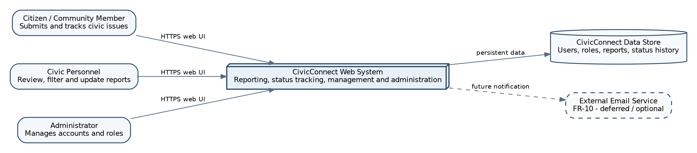
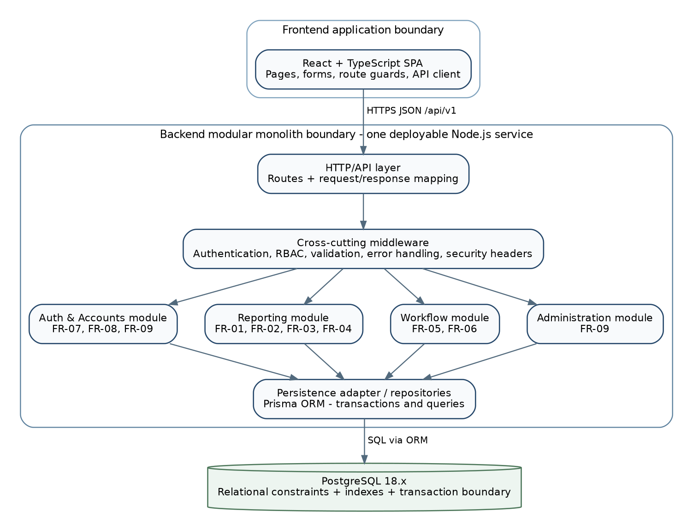
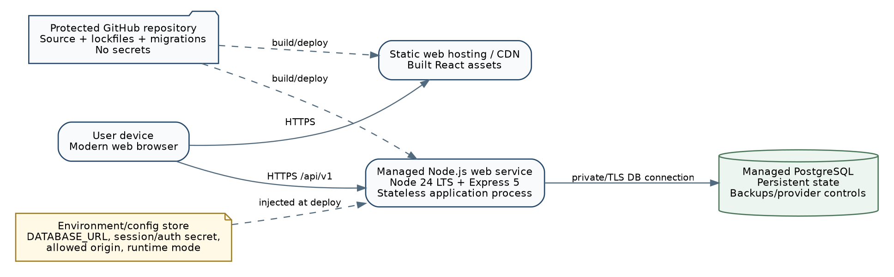

# Architecture alternatives and selected architecture

Three options were considered. The comparison is intentionally project-specific: the “best” architecture in the abstract is not the question. The relevant question is which option fits the M1 scope, quality drivers, three-person team and pilot deployment.

| **Option**                    | **Description**                                                                                                                                    | **Strengths**                                                                                                                                                                                       | **Main costs / risks**                                                                                                                                                                               | **Decision**                                    |
|-------------------------------|----------------------------------------------------------------------------------------------------------------------------------------------------|-----------------------------------------------------------------------------------------------------------------------------------------------------------------------------------------------------|------------------------------------------------------------------------------------------------------------------------------------------------------------------------------------------------------|-------------------------------------------------|
| A. Single full-stack monolith | One server renders pages and contains controllers, business logic and persistence.                                                                 | Lowest number of deployables; simple initial setup.                                                                                                                                                 | Frontend and backend concerns can become tightly coupled; weaker separation for a modern browser UI; high risk of large controllers if discipline is poor.                                           | Reasonable but not selected.                    |
| B. SPA + modular monolith API | React SPA communicates with one Node/Express API. Backend is one deployable but internally split into Auth, Reporting, Workflow and Admin modules. | Clear boundaries without microservice operations overhead; matches Node/Express team experience; easy to deploy; testable API; future modules can be extracted only if evidence later justifies it. | Requires two build targets (web + API) and clear CORS/config rules when hosted separately.                                                                                                           | Selected.                                       |
| C. SPA + microservices        | Separate services for auth, reports, workflow/admin and possibly notifications.                                                                    | Strong deployment independence and service-level scaling.                                                                                                                                           | Too many network boundaries, deployments, failure modes, secrets and observability needs for current scale. It would work against NFR-04 and schedule risk without a scale requirement demanding it. | Rejected for M2; reconsider only with evidence. |

## Selected architecture: SPA + modular monolith API

CivicConnect will use a browser-based single-page application (SPA) backed by one modular monolith API and one relational database. “Modular monolith” means the backend is deployed as one Node.js service, but the code is not treated as one undifferentiated codebase. Each business area has a defined responsibility and public interface. Cross-cutting concerns such as authentication, validation, error mapping and configuration are centralised rather than duplicated.

This architecture is proportionate to the current evidence. The pilot scale is small, the team has three members, the M1 scope deliberately excludes external municipal integration, and the availability target is 99% rather than a multi-region enterprise SLA. A microservice design would add network calls and operational failure points without solving a requirement that exists in the baseline.

## Responsibility boundaries

| **Boundary / module**              | **Owns**                                                                                        | **Does not own**                                                                 | **Key requirement links**                   |
|------------------------------------|-------------------------------------------------------------------------------------------------|----------------------------------------------------------------------------------|---------------------------------------------|
| Frontend SPA                       | Navigation, form UX, client-side validation feedback, role-aware UI, status display, API calls. | Authoritative authentication/authorisation, final validation rules, persistence. | FR-01 to FR-04, FR-06 to FR-09, NFR-02      |
| API / transport layer              | HTTP routing, request parsing, response status mapping, versioned /api/v1 boundary.             | Business decisions such as valid status transitions.                             | All implemented FR endpoints                |
| Auth & Accounts                    | Registration/login coordination, identity lookup, current user/role checks, account state.      | Issue workflow rules.                                                            | FR-07, FR-08, FR-09, NFR-03                 |
| Reporting                          | Create report, generate/reference report identity, read citizen-owned status/report data.       | Administrative account changes.                                                  | FR-01, FR-02, FR-03, FR-04                  |
| Workflow                           | Allowed report-status transitions, timestamps/history, staff list/filter use cases.             | User registration.                                                               | FR-05, FR-06                                |
| Administration                     | Account activation/deactivation and role changes.                                               | Citizen report content rules.                                                    | FR-09                                       |
| Persistence adapter / repositories | Database queries, transaction boundary, mapping persisted records to module-facing objects.     | HTTP response formatting or UI concerns.                                         | NFR-05, FE-03; supports all data-backed FRs |
| PostgreSQL                         | Durable state, relational integrity constraints, indexes, transaction support.                  | Presentation or business workflow policy beyond enforceable integrity rules.     | NFR-04, NFR-05, NFR-06                      |

## Trade-offs accepted by this architecture

- One backend deployable is a deliberate single application boundary. A backend outage affects all API features, but this is simpler to operate and test than several services at the current scale.

- The database remains a major dependency and potential single point of failure. M2 should record managed backup/recovery and provider availability assumptions, while full HA is not justified by the pilot evidence.

- A separate SPA makes the frontend replaceable and keeps browser UX concerns separate, but it introduces API versioning, CORS and environment configuration that a server-rendered application would not need.

- Module boundaries are enforced mainly through code structure, interfaces and review rather than physically separate deployments. That requires discipline in imports and ownership.

# Architecture diagrams and responsibility boundaries

The diagrams use a C4-inspired level of abstraction. The context view shows people and the software system, the logical/container view shows responsibilities inside the solution, and the deployment view shows physical runtime placement. Keeping these views separate prevents the common mistake of treating “React”, “Node” or “PostgreSQL” as the architecture itself.

**Figure 2. Logical/container architecture - React SPA + one modular Node/Express backend + PostgreSQL. Business module boundaries are inside the backend deployable.**

**Figure 3. Deployment-direction view - provider-neutral PaaS/static hosting + managed PostgreSQL. Exact vendor selection remains a deployment decision unless the team has already approved one.**

## Main interactions

1.  Citizen opens the React application over HTTPS and submits a report form.

2.  The frontend sends JSON to the versioned API. Frontend validation may catch simple mistakes early, but the API repeats validation because client-side checks can be bypassed.

3.  Authentication/RBAC middleware resolves the current user and blocks requests that do not have permission for the requested operation.

4.  The relevant module service executes the use case. Reporting owns report submission/status retrieval; Workflow owns staff status transitions/filtering; Administration owns account role/status changes.

5.  The persistence adapter performs the required database operation. Multi-step updates that must succeed or fail together are executed inside a transaction.

6.  The API maps the result to a controlled response. Errors are logged server-side without leaking secrets or unnecessary internal details to the user.
